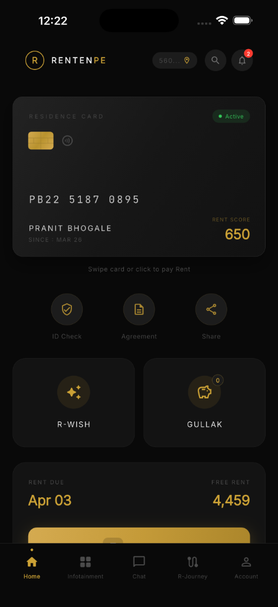

# RentPe Redesign

A modern, premium redesign of the RentPe mobile application built with Flutter.

<br>
<p align="center">
  
</p>
<br>

## 🚀 Features

- **Modern UI/UX**: Clean, minimalist design with glassmorphism effects.
- **Dark Theme**: A sophisticated dark color palette with gold accents.
- **3D Flip Card**: Interactive residence card with realistic 3D flip animation.
- **Smooth Animations**: Physics-based scrolling and micro-interactions.
- **Bottom Navigation**: Custom bottom navigation bar with active indicators.

## 🛠️ Tech Stack

- **Framework**: Flutter
- **Language**: Dart
- **State Management**: Not applicable (Static UI)
- **Architecture**: Component-based

## 📂 Project Structure

```
lib/
├── core/
│   ├── constants/  # App strings and constants
│   ├── theme/      # Theme configuration (colors, typography)
│   └── utils/      # Utility functions
├── features/
│   └── home/       # Home screen and its components
│       ├── home_screen.dart
│       └── widgets/  # Reusable widgets for the home screen
└── shared/         # Shared widgets across the app
    └── widgets/
        └── flip_card.dart
```

## 🎨 Design System

### Colors
- **Background**: `#111111`
- **Card Background**: `#1A1A1A`
- **Gold Accent**: `#D4AF37`
- **Text**: `#FFFFFF`
- **Muted Text**: `#A3A3A3`

### Typography
- **Font**: Inter (via Google Fonts)
- **Primary**: Bold, 24px
- **Secondary**: Medium, 16px
- **Labels**: Regular, 12px

## 🏃 Getting Started

### Prerequisites
- Flutter SDK (stable channel)
- Dart SDK

### Installation

1. Clone the repository:
   ```bash
   git clone <repository-url>
   cd rentpe_redesign
   ```

2. Install dependencies:
   ```bash
   flutter pub get
   ```

3. Run the application:
   ```bash
   flutter run
   ```

## 📱 Running the App

The app opens directly to the Home Screen featuring:
1.  **HomeAppBar**: Greeting and profile section.
2.  **ResidenceCard**: Interactive 3D flip card.
3.  **QuickActions**: Horizontal scrollable actions.
4.  **FeatureCards**: Grid of feature cards.
5.  **RentPaymentSection**: Rent payment summary.
6.  **BottomNavBar**: Navigation with active state indicators.


